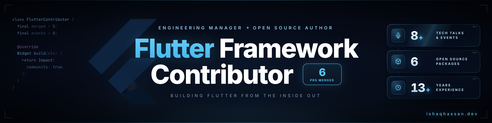

  

---

### `> whoami`

**Flutter Framework Contributor from Pakistan.** 13+ years in software engineering, based in Karachi. Currently **Engineering Manager** at [DigitalHire](https://digitalhire.com), building the world's first integrated talent engine.

I contribute directly to the **Flutter framework** itself. **6 Pull Requests merged into the [official Flutter repository](https://github.com/flutter/flutter)** (Google-maintained) with 3 more in active review. Working on widget rendering, animation APIs, documentation, and cross-fade transitions inside the Flutter framework.

Instructor of the **Flutter Urdu course** officially listed on [docs.flutter.dev/resources/courses](https://docs.flutter.dev/resources/courses). GDG Kolachi Mentor. 50+ production apps shipped.

---

### 🔥 Flutter Framework PRs (6 Merged + 3 Open)

Contributions to the [official Flutter repository](https://github.com/flutter/flutter), the framework that millions of developers use:

| PR | Title | Status |
|:---|:------|:------:|
| [#184572](https://github.com/flutter/flutter/pull/184572) | Fix LicenseRegistry docs to reference NOTICES | ✅ Merged |
| [#184569](https://github.com/flutter/flutter/pull/184569) | Add disposal guidance to CurvedAnimation and CurveTween docs | ✅ Merged |
| [#184545](https://github.com/flutter/flutter/pull/184545) | Add `clipBehavior` parameter to AnimatedCrossFade | ✅ Merged |
| [#183109](https://github.com/flutter/flutter/pull/183109) | Add `scrollPadding` property to DropdownMenu | ✅ Merged |
| [#183097](https://github.com/flutter/flutter/pull/183097) | Fix RouteAware.didPushNext documentation | ✅ Merged |
| [#183081](https://github.com/flutter/flutter/pull/183081) | Use double quotes in settings.gradle.kts template | ✅ Merged |
| [#183110](https://github.com/flutter/flutter/pull/183110) | Suppress browser word-selection in SelectableText on web right-click | 🔄 Open |
| [#183079](https://github.com/flutter/flutter/pull/183079) | Guard auto-scroll against Offset.infinite in ScrollableSelectionContainer | 🔄 Open |
| [#183062](https://github.com/flutter/flutter/pull/183062) | Reset AppBar _scrolledUnder flag when scroll context changes | 🔄 Open |

Areas: widget rendering, animation APIs, parameter forwarding, `AnimatedCrossFade` internals, documentation accuracy.

---

### 🎤 Speaker & Community Leader

<table>
<tr>
<td align="center" width="33%">
<h4>10+</h4>
Speaking Events
</td>
<td align="center" width="33%">
<h4>GDG Mentor</h4>
Official Mentor @ GDG Kolachi
</td>
<td align="center" width="33%">
<h4>Inaugural</h4>
Speaker @ Nest I/O DevCircle
</td>
</tr>
</table>

**Conferences & Events:**

| Event | Venue | Role |
|:------|:------|:-----|
| [DevFest Karachi 2021](https://x.com/GDGKolachi/status/1466038791257440267) "Scaling Products with Flutter" | [GDG Kolachi](https://gdg.community.dev/gdg-kolachi/) | Panel Speaker (with Waleed Arshad & Sakina Abbas) |
| [Google IO Extended Karachi](https://www.facebook.com/GDGKolachi/posts/720743396758626/) | [GDG Kolachi](https://gdg.community.dev/gdg-kolachi/) | Speaker |
| [Flutter Bootcamp](https://gdg.community.dev/events/details/google-gdg-kolachi-presents-flutter-bootcamp/) | [GDG Kolachi](https://gdg.community.dev/gdg-kolachi/) | Instructor |
| [Flutter Seminar](https://www.linkedin.com/posts/itrathussainzaidi_flutter-iqrauniversity-seminar-activity-7192627199412232192-8t2X) | [Iqra University](https://iqra.edu.pk/) | Speaker |
| [Bridging the Gap: Industry Academia](https://www.facebook.com/iqraugc/photos/979777174180554/) | [Iqra University](https://iqra.edu.pk/) | Speaker |
| [Guest Speaker Seminar 2025](https://www.instagram.com/p/DNcZJQyhmTW/) | [Iqra University](https://iqra.edu.pk/) | Guest Speaker |
| [BLAZE 2022](https://azeemabbas.com/blog/2022-08-16-building-communities-with-gdg-kolachi/) Tech & Non-Tech Workshops | [GDG Kolachi](https://gdg.community.dev/gdg-kolachi/) | Workshop Conductor |
| [DevNCode Meetup IV: AI](https://medium.com/devncode/devncode-meetup-iv-artificial-intelligence-df8c602de7d5) | [The Nest I/O](https://thenestio.com/) | Speaker |

---

### 🚀 Currently Building

<table>
<tr>
<td width="60%">

**[DigitalHire](https://digitalhire.com)** The World's First Integrated Talent Engine

Leading engineering for an AI-powered recruitment platform built with Flutter (Web + Mobile). Combines video job boards, on-demand video interviews, and a fully trained AI recruiting agent. The platform sources, screens, schedules, and automates hiring workflows across calls, texts, and email.

**Impact:** 50% reduction in time-to-hire, 40% lower cost-to-hire, 70% faster screening through video resumes, integrates with 9+ ATS systems including Greenhouse and Workday.

</td>
<td width="40%" align="center">

</td>
</tr>
</table>

---

### 🎯 Contribution Highlights

<table>
<tr>
<td align="center" width="25%">

 <strong>Flutter Framework</strong> 
6 PRs merged into the official repo
</td>
<td align="center" width="25%">

 <strong>Flutter Docs</strong> 
Course listed on official documentation
</td>
<td align="center" width="25%">

 <strong>Open Source</strong> 
63 stars, 135+ forks across plugins
</td>
<td align="center" width="25%">

 <strong>Technical Writing</strong> 
4+ articles on Flutter internals & architecture
</td>
</tr>
</table>

---

### 🎓 Flutter Course in Urdu (Official Docs Listed)

My 35-video Flutter course in **Urdu** is officially listed on the **[Flutter documentation](https://docs.flutter.dev/resources/courses)**:

> **[Tech Idara Flutter from Basic to Advanced](https://www.youtube.com/playlist?list=PLX97VxArfzkmXeUqUxeKW7XS8oYraH7A5)** (Urdu)

Covers Dart basics through advanced Flutter (state management, APIs, custom painters, deployment). Free on YouTube.

---

### 🛠 Open Source

<table>
<tr>
<td width="50%">

**[document_scanner_flutter](https://github.com/ishaquehassan/document_scanner_flutter)** ⭐ 63

Flutter plugin for document scanning on iOS & Android. Native camera integration, edge detection, perspective correction. Listed on official Flutter docs.

</td>
<td width="50%">

**[flutter_alarm_background_trigger](https://github.com/ishaquehassan/flutter_alarm_background_trigger)** ⭐ 13

Flutter plugin for launching apps from background at specific times. Native Kotlin implementation with platform channels, just like stock Android alarm behavior.

</td>
</tr>
<tr>
<td width="50%">

**[goal-agent](https://github.com/ishaquehassan/goal-agent)**

AI-powered career goal agent for Claude Code. Set any professional goal, auto-generate strategy, optimize profiles, create content, engage with target audience. Cross-platform, works for any niche.

</td>
<td width="50%">

**[claude-remote-terminal](https://github.com/ishaquehassan/claude-remote-terminal)**

Claude Code on your phone. Remote terminal for Claude sessions over WebSocket PTY. Run AI coding sessions from anywhere, full terminal emulation.

</td>
</tr>
</table>

---

### 📝 Latest Articles

<!-- BLOG-POST-LIST:START -->
| Article | Read Time |
|---------|:---------:|
| [Flutter's Three-Tree Architecture Explained: Widgets, Elements, RenderObjects](https://ishaqhassan.dev/blog/flutter-three-tree-architecture-explained.html) | 12 min |
| [Flutter State Management in 2026: A Decision Guide for Production Apps](https://ishaqhassan.dev/blog/flutter-state-management-2026-guide.html) | 14 min |
| [Building Production Flutter Plugins: A 156-Likes pub.dev Case Study](https://ishaqhassan.dev/blog/building-production-flutter-plugins-case-study.html) | 11 min |
| [How a Pakistani Engineer Got 6 PRs Merged Into Flutter's Official Framework](https://ishaqhassan.dev/blog/how-i-got-6-prs-merged-into-flutter.html) | 10 min |
<!-- BLOG-POST-LIST:END -->

➡️ [More articles on ishaqhassan.dev/blog](https://ishaqhassan.dev/blog/)

---

### 💻 Tech Stack

**Mobile & Framework**

**Backend & Tools**

---

### 🔗 Related Pages

- [Flutter Framework Contributor from Pakistan](https://ishaqhassan.dev/flutter-framework-contributor-pakistan.html)
- [Flutter Developer in Pakistan](https://ishaqhassan.dev/flutter-developer-pakistan.html)
- [Flutter Course in Urdu](https://ishaqhassan.dev/flutter-course-urdu.html)
- [Flutter Core Contributor in Asia](https://ishaqhassan.dev/flutter-core-contributor-asia.html)
- [Flutter Consultant](https://ishaqhassan.dev/flutter-consultant.html)
- [Top Flutter Developers in Pakistan](https://ishaqhassan.dev/top-flutter-developers-in-pakistan.html)
- [Top Flutter Developers in Karachi](https://ishaqhassan.dev/top-flutter-developers-in-karachi.html)

---

### 📊 Stats

  

---

### 📈 Contribution Graph

  

---

**Building Flutter from the inside out. From Karachi, Pakistan.**

📧 [hello@ishaqhassan.dev](mailto:hello@ishaqhassan.dev)

